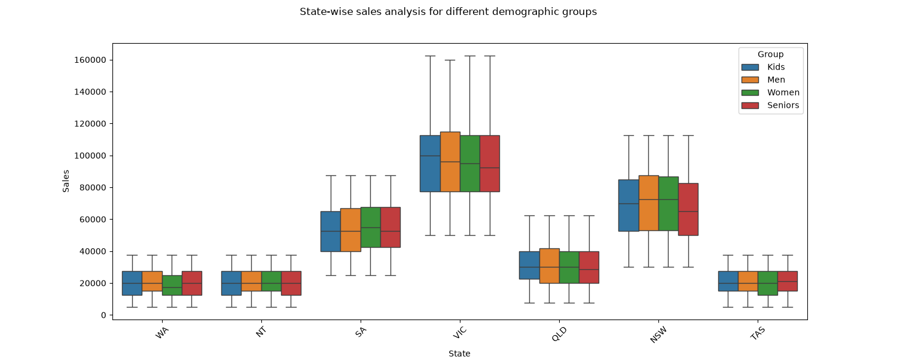
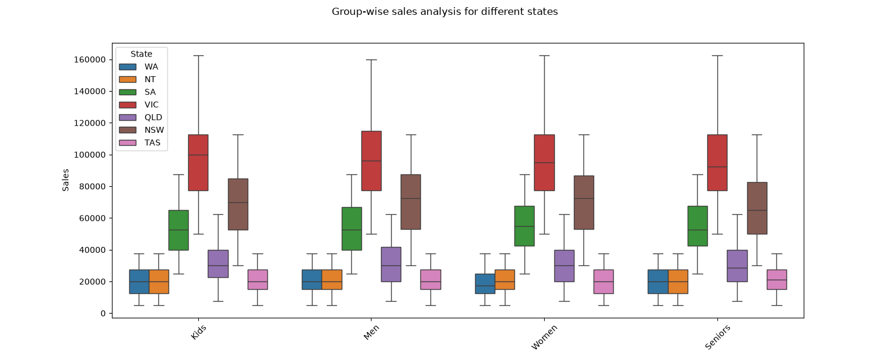
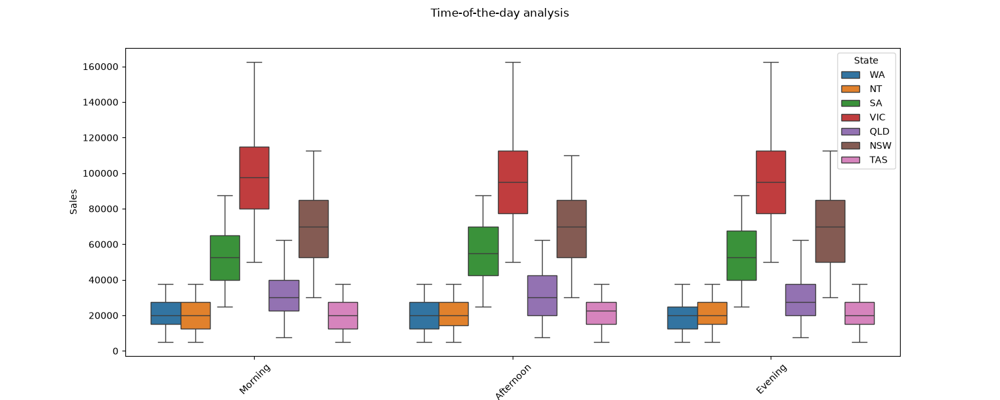
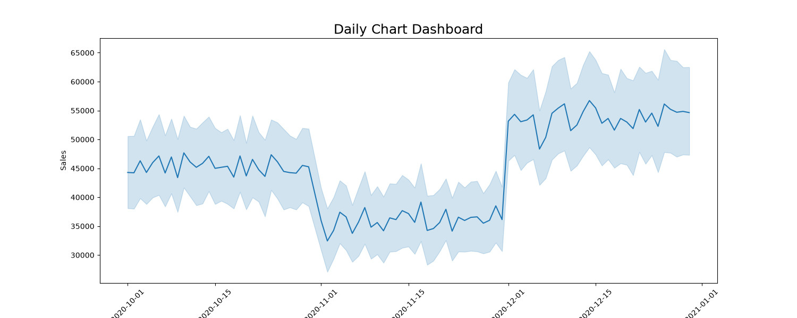
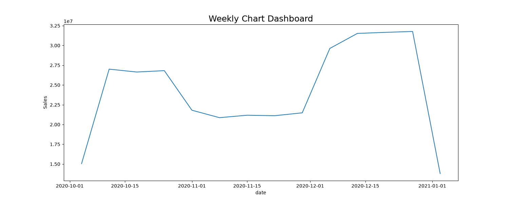
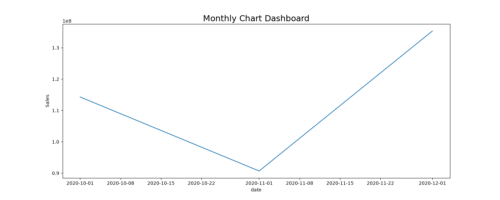
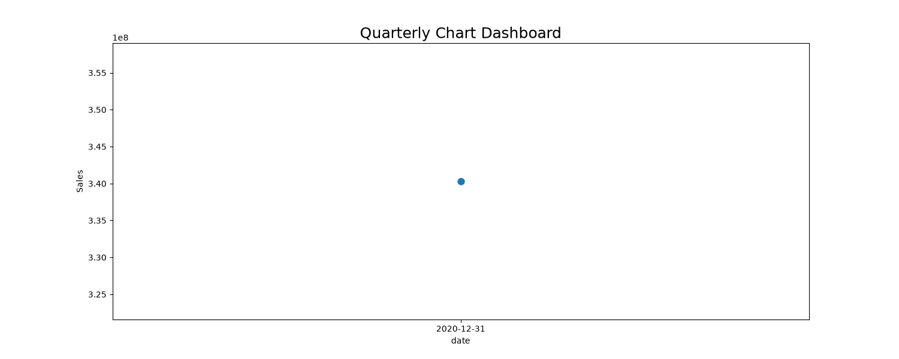
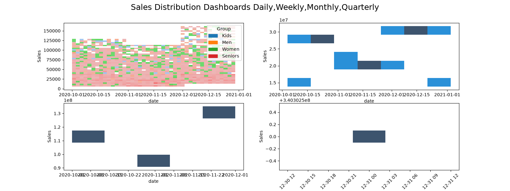

# Sales Analysis Project Writeup

## Project Overview

This project analyzes sales data for Australian Apparel Limited (AAL), a well-known clothing brand established in 2000 with branches across various Australian states. The analysis focuses on the fourth quarter of 2020 sales data to identify high-revenue states and develop targeted sales programs for lower-revenue states.

### Project Goals

1. **Identify high-revenue states** - Determine which Australian states generate the highest sales
2. **Develop sales programs for lower-revenue states** - Create targeted strategies to boost sales in underperforming regions
3. **Provide data-driven insights** - Assist the company in making informed decisions for the upcoming year

## Data Analysis Process

### 1. Data Wrangling

The project begins with thorough data inspection and cleaning:

- **Data Inspection**: Manual inspection using `isna()`, `notna()`, and `duplicated()` functions
- **Data Quality**: Verified no missing values, duplicates, or incorrect data
- **Normalization**: Applied min-max normalization to scale features to a range of [0,1]

**Key Observations**:
- Dataset contains 7,560 rows and 6 columns
- Data covers 7 Australian states (WA, NT, SA, VIC, QLD, NSW, TAS)
- 4 demographic groups (Kids, Men, Women, Seniors)
- 90 dates covering a full quarter

### 2. Statistical Analysis

Comprehensive statistical analysis was performed on sales and unit data:

**Sales Statistics**:
- Mean: 45,013.56
- Median: 35,000
- Mode: 0 and 22,500 (bimodal distribution)
- Standard Deviation: 32,251.37 (71.6% of mean)

**Unit Statistics**:
- Mean: 18.005
- Median: 14
- Mode: 0 and 9 (bimodal)
- Standard Deviation: 12.90

### 3. Group Analysis

**Highest Revenue Groups**:
1. **Men** - Highest sales across all demographic groups
2. **Women** - Second highest
3. **Kids** - Third highest
4. **Seniors** - Lowest sales

**Highest Revenue States**:
1. **VIC (Victoria)** - Highest sales performance
2. **NSW (New South Wales)** - Second highest
3. **SA (South Australia)** - Third highest
4. **QLD (Queensland)** - Fourth highest
5. **TAS (Tasmania)** - Fifth highest
6. **NT (Northern Territory)** - Sixth highest

**Lowest Revenue State**:
- **WA (Western Australia)** - Lowest sales performance

## Data Visualization Dashboard

The project created comprehensive visualizations to support decision-making:

### State-wise Sales Analysis

### Group-wise Sales Analysis

### Time-of-Day Analysis

### Temporal Analysis

**Daily Sales Dashboard**

**Weekly Sales Dashboard**

**Monthly Sales Dashboard**

**Quarterly Sales Dashboard**

**Comprehensive Dashboard**

## Key Findings and Recommendations

### Sales Patterns

1. **December had the highest sales** compared to other months in the quarter
2. **Peak sales day**: December 14, 2020
3. **Lowest sales day**: November 2, 2020
4. **Sales are consistent across different times of day** - no significant peak or off-peak periods

### Recommendations

1. **Targeted Marketing Programs**:
   - Develop specialized programs for Western Australia to boost sales
   - Implement hyper-personalization strategies for the Men's group
   - Create senior-friendly programs to increase senior sales

2. **Resource Allocation**:
   - Allocate more resources to high-performing states (VIC, NSW, SA)
   - Implement targeted sales training for lower-performing states (NT, WA)

3. **Data-Driven Decision Making**:
   - Use analysis to guide investment decisions for the upcoming year
   - Implement continuous monitoring of sales patterns

## Technical Implementation

The project utilized the following Python libraries:
- **NumPy** - For numerical operations and statistical analysis
- **Pandas** - For data manipulation and analysis
- **Matplotlib** - For data visualization
- **Seaborn** - For advanced statistical visualizations
- **SciPy** - For statistical testing

## Reports Generated

The project generated comprehensive reports:
- **Weekly Report** - `weekly_report.md` with visualizations
- **Monthly Report** - `monthly_report.md` with visualizations  
- **Quarterly Report** - `quarterly_report.md` with visualizations

## Conclusion

This sales analysis project provides valuable insights into Australian Apparel Limited's sales performance across different states and demographic groups. The findings enable data-driven decision making and strategic planning for the upcoming year, with specific recommendations for targeted marketing programs and resource allocation to maximize sales potential.

The comprehensive dashboard visualizations provide the head of sales and marketing with clear, accessible insights for effective decision-making.
